# langchain-share

希望大家能通过这个项目里面的代码简单一窥langchain的使用和背后的原理。对于从来没接触python或者langchain的同事可能一开始会比较难，同样的，对已经用langchain开发过很多应用的大佬这个可能会太过基础。但是还是希望大家能通过这个项目有所收获。可能大家其实已经听过看过很多和LLM开发相关的公众号，PPT，也听了很多同事的分享。但是我自己调查后发现，很少有同事去真的写过，实现过。因此这个项目里面的代码希望大家都能去跑跑看，然后改改看，既然你来听了这个分享，说明你多少对LLM应用开发是有点兴趣的。

### 如果是前端同事或者只想跑下js版本

考虑到前端同事，我在项目的JavaScript文件夹下用langchain的js版本实现了一遍里面大部分代码，除了其中第五部分，因为第五部分和python本身有比较强关联。还有一些可能太过简单或者和某个其他代码高度相似，也就没有实现。所有python版本代码块中，如果有对应的js版本，我都在开头用注释标出了对应的js版本的名称。

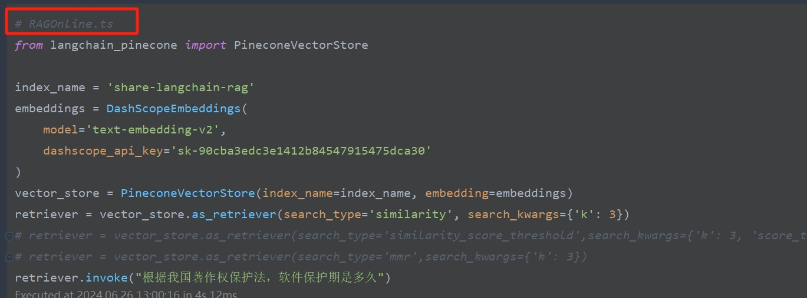

js版本环境或者安装依赖啥的应该都不需要说，这里只提一个点，就是所有代码都是ts写的，node不能直接执行ts。最早可能大家都会使用node-ts这模块来直接执行ts文件。但是我很早之前使用这个模块发现经常出问题，所以我这里推荐的是用[tsx](https://tsx.is/)这个模块来执行。它是的前身是esno，一个利用esbuild将ts转成js然后执行的命令行工具。你可以全局安装tsx(我觉得这种执行工具全局安装会用着舒服点)，我的依赖里面本身也有。所有的ts文件都通过tsx执行过。我本地使用的node是最新的lts版本20。但是应该在16以上的node环境执行都没问题。如果遇到问题，可以尝试用nvm之类的换成20尝试。

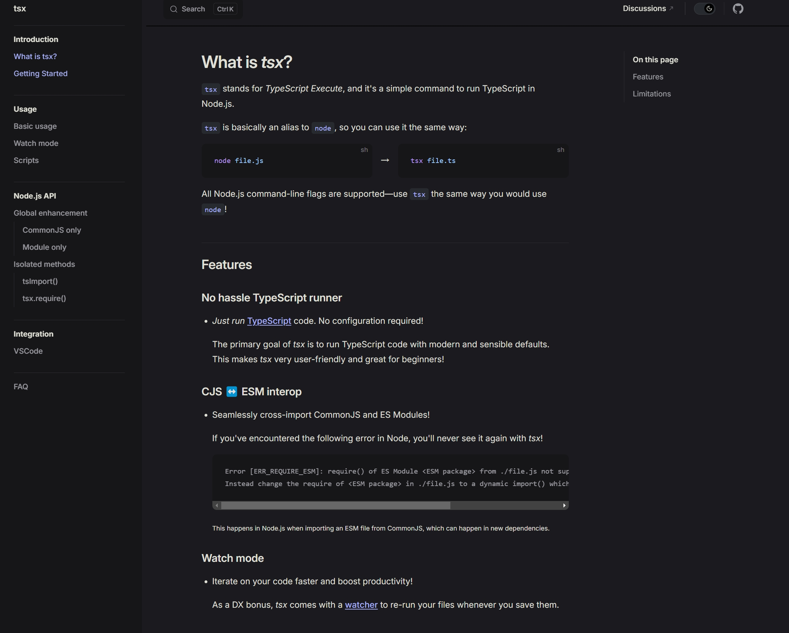

### 如果要运行notebook

考虑到大家大部分都是java或者前端背景，我这里简单阐述下如何配置环境，让这个项目运行起来

首先项目整个是用poetry做的包管理，里面notebooks部分是用的jupyter
notebook来编写的，这个是一个可以同时容纳markdown和代码的交互式笔记本，在数据科学和AI领域使用非常广泛。一个notebook里面有markdown块和code块，前者执行可以生成markdown对应内容，后者执行可以执行代码本身并输出。jupyter
notebook默认自带python的内核因此只支持python代码运行，因为它是python编写的。其实它也可以安装很多种其他语言的内核，但是比较麻烦。所以notebook里面我这里只有python版本。js版本统一在JavaScript文件夹下新开了一个node项目。

如果你只是看看这个项目，那你不需要任何环境，你用vscode或者pycharm之类的编辑器或者IDE打开就可以看到已经运行好的结果和markdown部分。如果你不止是查看，还需要运行下，那你需要有一个python的环境。安装python是一个非常简单的事情，这里就不阐述了，因为python安装基本一路点击next就完事了，也没有java完成后还需要配置一些变量这种情况。这里说两个点，首先你安装的python选择3.10及以上版本(
现在最新是3.12)
，千万不要去安装python2，这两个差别非常大。第二，有些同事问过，anaconda是啥，装官方的还是装anaconda。anaconda其实可以理解官方的python自带了很多科学计算需要的包，其中也有jupyterlab。不过你如果之前没写过python，我不建议上来就用anaconda。

装好python环境后，可以在命令行输入python回车验证下。python自带一个pip的工具，这个和npm类似，就是python自带的包管理器。但是它非常原始，使用也并不简单。所以我这个项目使用了一个叫poetry的包管理器，langchain的代码也是使用的这个包管理器。所以你安装好python之后，先通过pip
install
poetry去安装好poetry。一般来说如果你是windows，你安装poetry之后，你去命令行执行poetry会发现还是没有找到，这时候你需要看你的这个位置`C:\Users\zhoud\AppData\Roaming\Python\Python312\Scripts`
，去这个置看能不能找到poetry.exe。能找到，就把那个位置加入path，再执行poetry就可以了。注意你的位置和我的位置是不会完全一样的，你的电脑用户名不是`zhoud`
,你的python版本也不一定是3.12，因此`zhoud`和`Python312`这两个部分你需要根据你的情况考虑。最终反正应该能在这个路径下找到poetry.exe

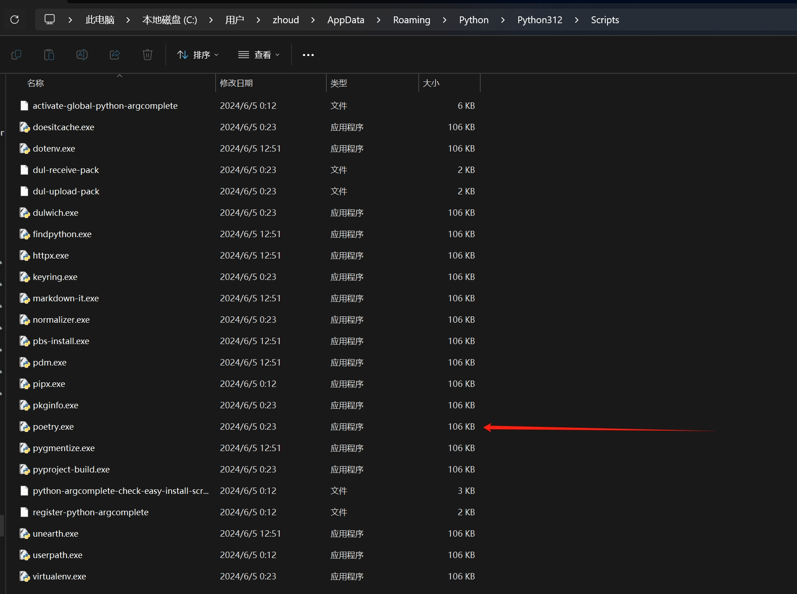

将这个路径加入到path之后，就可以新开一个cmd，输入poetry，这时候应该就会输出正常了。

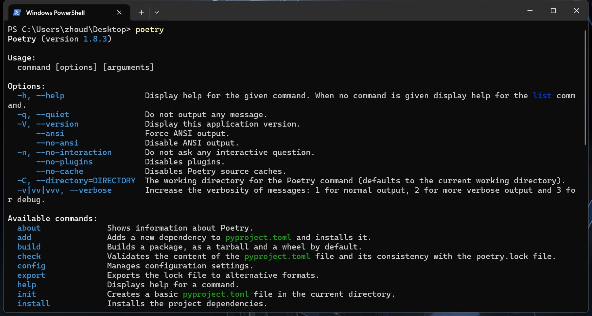

这时候进入到项目根目录，也就是这个文件所在目录，执行`poetry shell`
，这时候你的控制台命令行起始位置会发生变化，会生成一个带括号的前缀，这个表明poetry帮你激活了虚拟环境。所谓虚拟环境就是python用来隔离不同项目之间依赖，python版本等的一个手段。比如你激活了一个虚拟环境A，然后执行`pip install 某个package`
你退出这个虚拟环境后，是找不到这个package的。

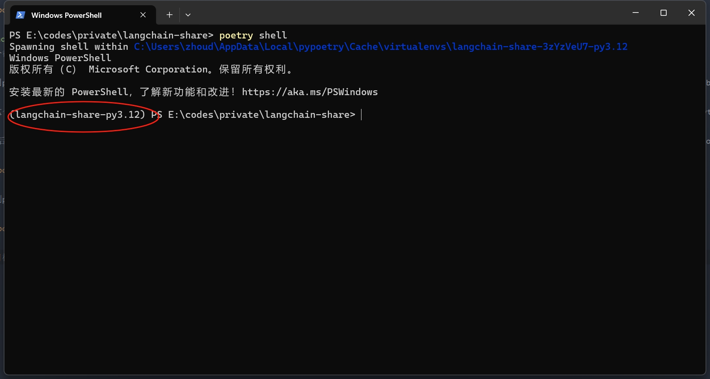

激活成功poetry之后，只需要执行`poetry install`
即可安装项目依赖，这个和npm，还有很多新一点的语言的包管理器操作都类似，都有install，build，init什么的。这个项目在pyproject.toml里面已经配置好了python的镜像源(
清华的源)，所以大家不需要单独去配置国内源来做加速。

安装完成后，也就装好了jupyterlab了，因为这个依赖是写入到了项目的依赖配置中的，当然你也可以通过`poetry add jupyterlab`来安装。
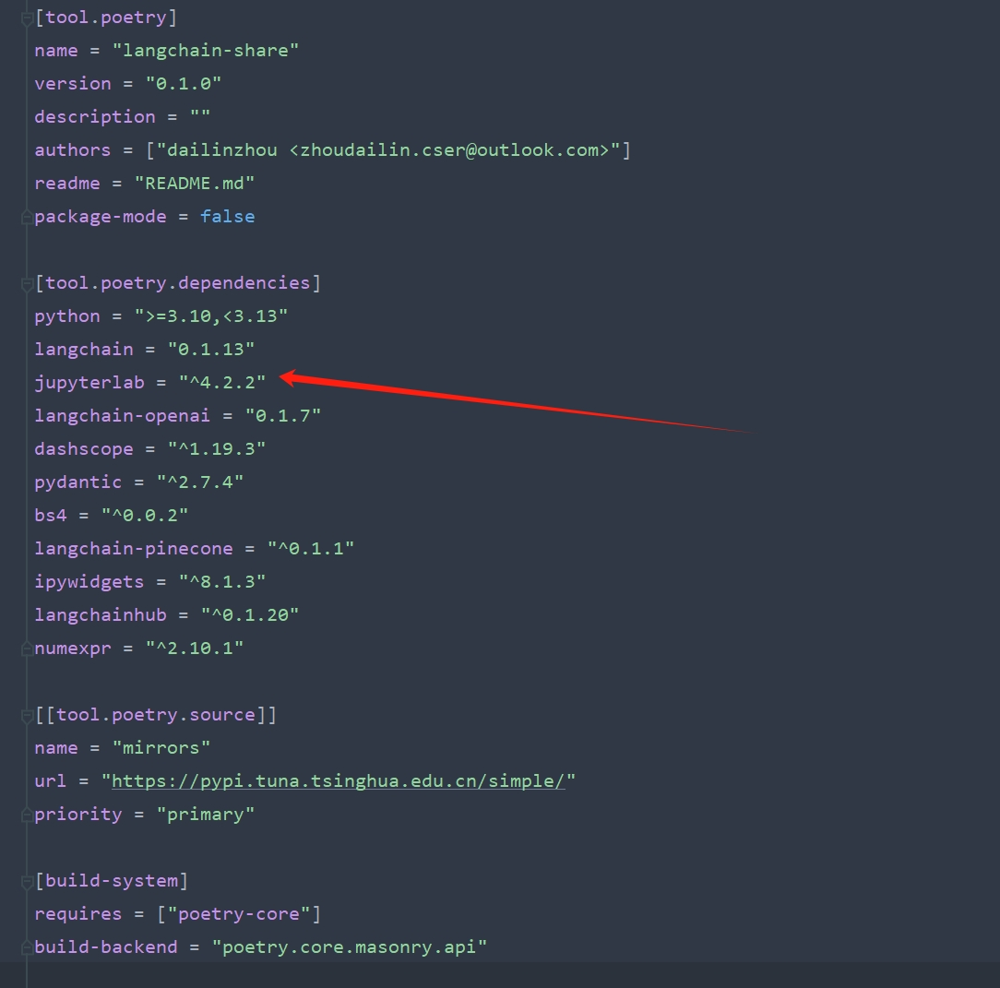

依赖安装完成后，有两种启动方法，第一种如果你没有pycharm，也不准备去下载一个，那么你在命令行(保证虚拟环境激活状态)执行jupyter lab即可。等待一会启动完毕后，点击或者访问最后给出来的那个带token的链接，就会打开你的浏览器，以web IDE的形式使用jupyter lab。

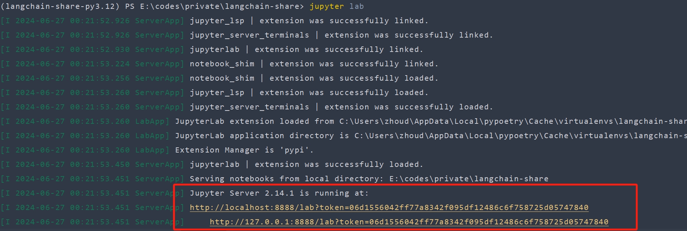

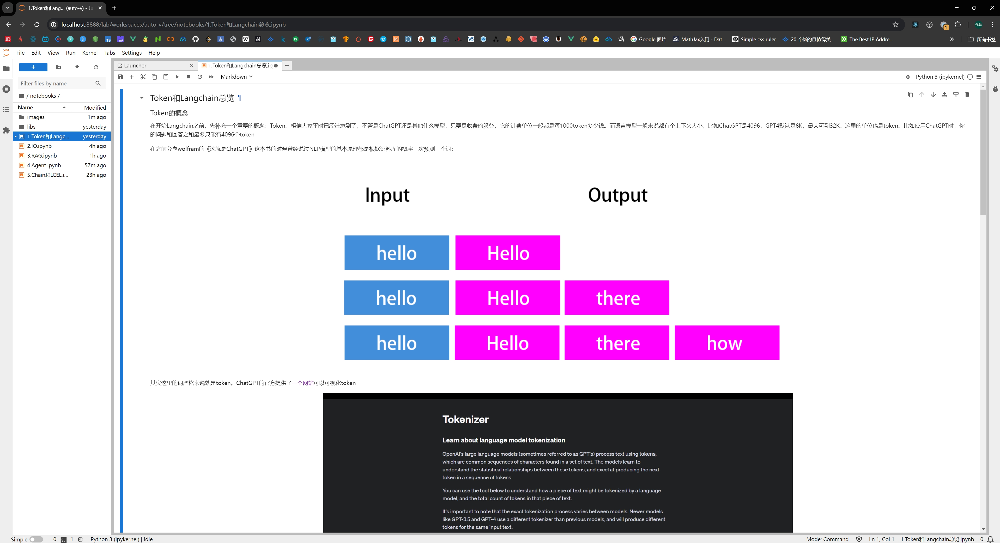

这种方式比较简单，也不依赖IDE，同时也是你去远程连接一个gpu服务器然后运行比较常用的方式，但是这个有个缺点，就是你如果遇到一个函数，你忘了参数(因为python是弱类型语言，提示远远不如java这种强类型语言来得靠谱)，你希望点击到源码里面去看看doc，那么这种情况就办不到。这时候你就可以用pycharm。

如果你有pycharm，首先用pycharm打开这个项目，右下角配置解释器，新增一个local的解释器。然后进去之后选择最后的poetry(可能需要比较新一点的版本才有)，配置好你的python路径和poetry路径就可以了。这样的话以后你pycharm打开，它就会自动帮你激活虚拟环境，不需要手动去`poetry shell`。

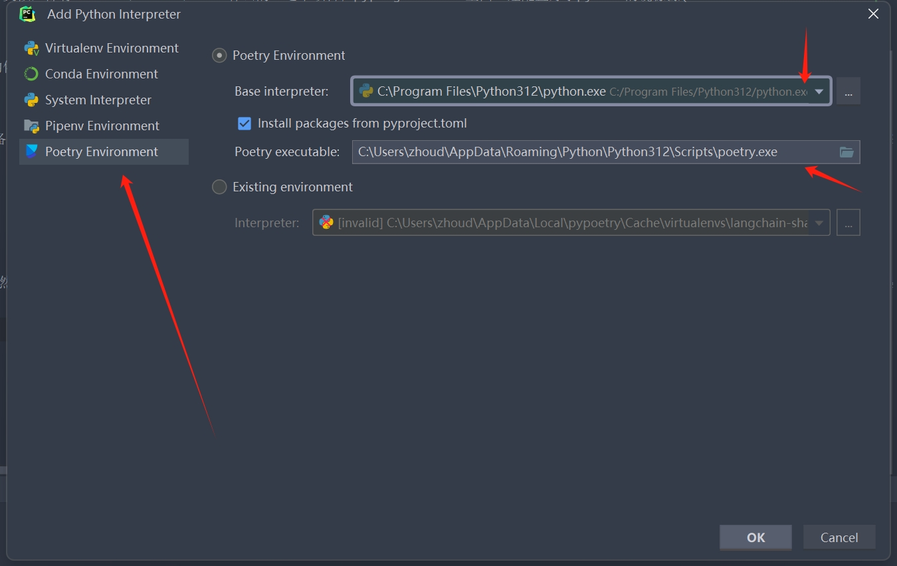

这时候打开一个notebook，找到右上角配置jupyter服务器的位置，然后配置，将里面的启动命令改成lab(默认值应该是notebook --no-browser，jupyter notebook是jupyter lab的上一代，现在也还有很多人喜欢这个版本的，大家有兴趣自己去了解)，然后找到一个代码块，ctrl+enter执行这个代码块，pycharm就会自动帮你去启动jupyterlab了

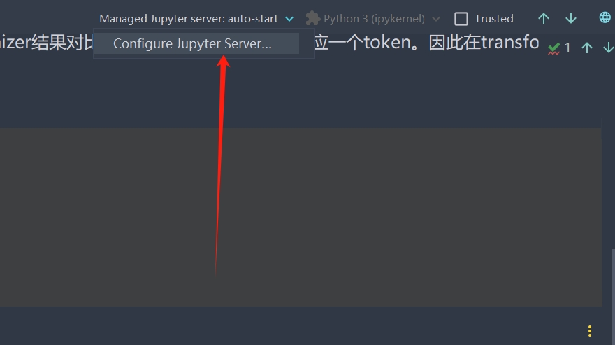

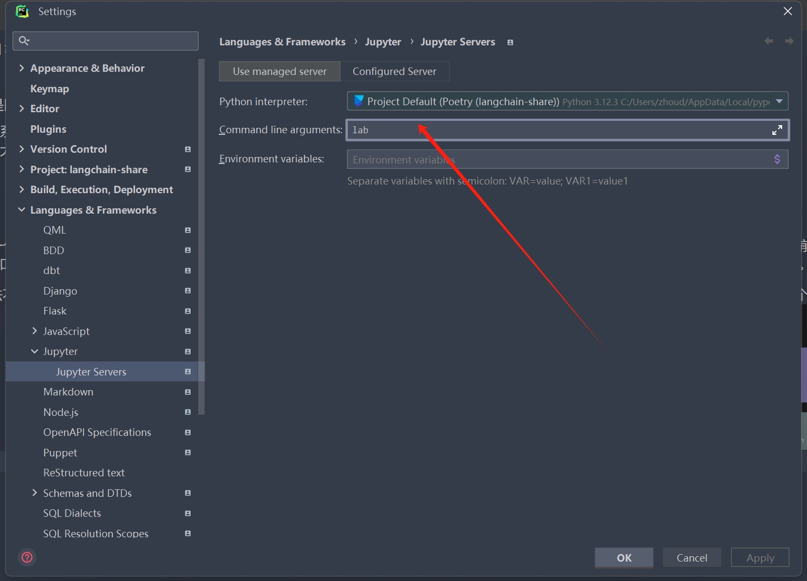

到此基本上就完成了配置工作，你就可以运行里面的代码块了。

### 几个apikey
因为项目用到好几个外部服务：通义千问72b-chat，searchapi和pincone以及chatgpt。除了72b-chat的apikey，都是通过执行的时候去读环境变量里面的值，如果没有会提示你输入。通义千问因为是送的token，量还非常多，而且有效期只到7月2号，所以我就没有隐藏，大家直接用即可。我希望有条件的同事去自己申请pinecone和searchapi。如果你确实有环境上的困难，可以使用这两个key，不要故意去频繁调用消耗里面的资源即可

searchapi: uvsyHmUyBkuKuCHpRKeeYqDH
pinecone: d67995d3-35be-4216-9151-c75d7eca0ef2

最后如果大家在项目运行过程中遇到啥问题，或者发现了项目本身的错误以及只是单纯想交流，都可以通过招乎联系我。